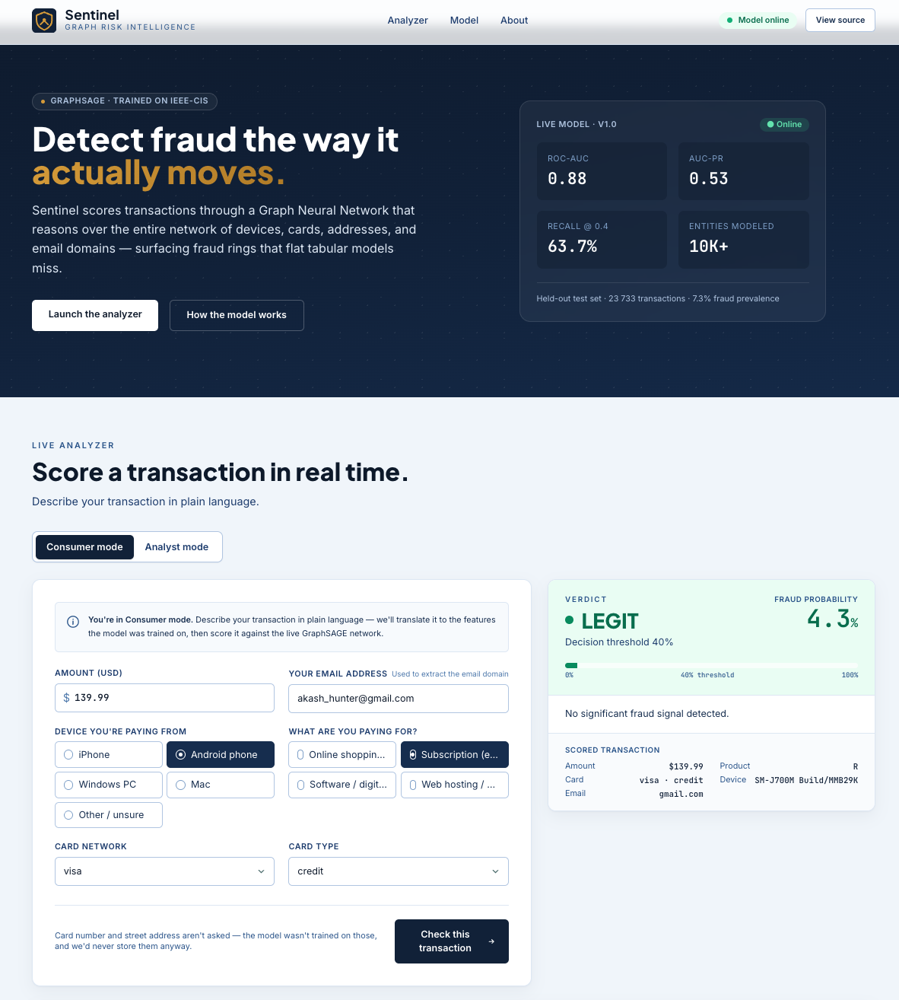
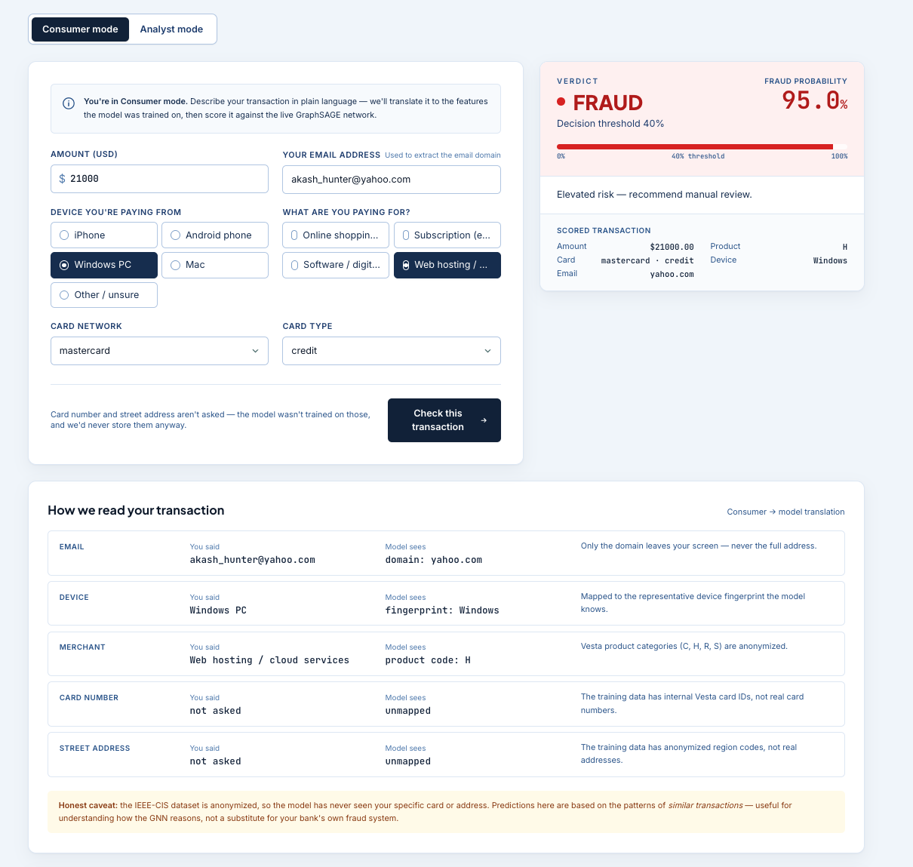
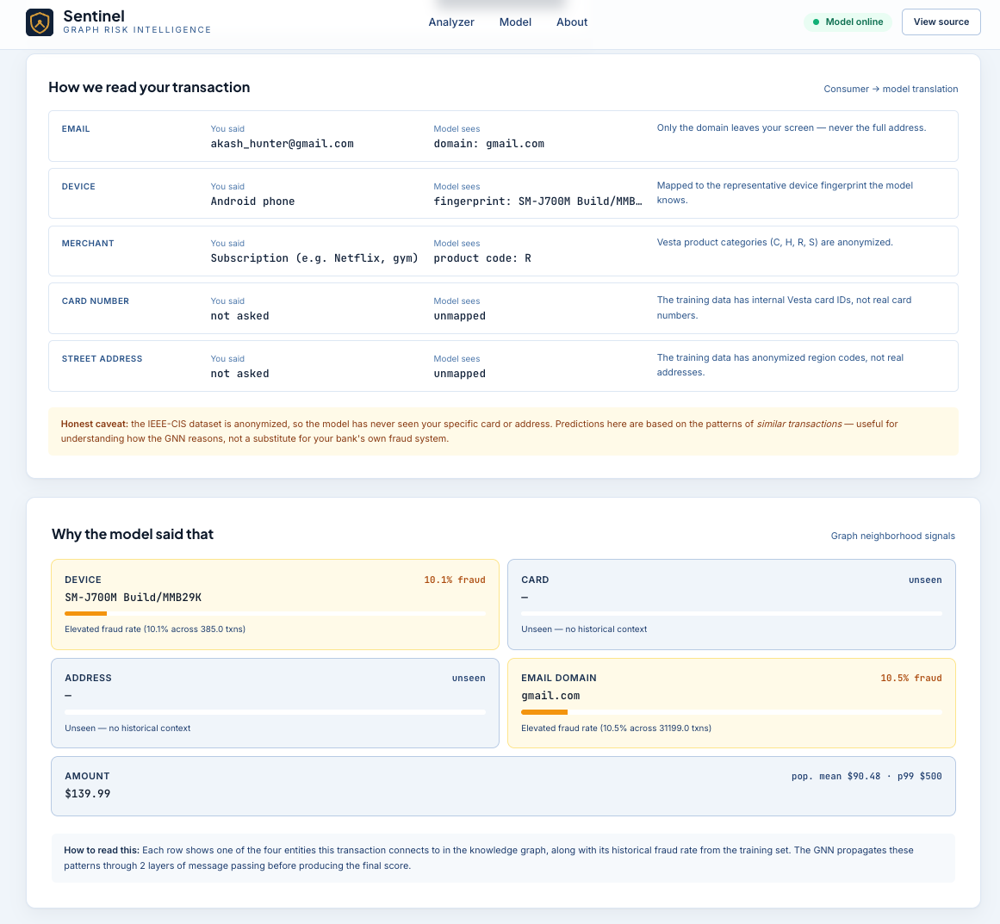
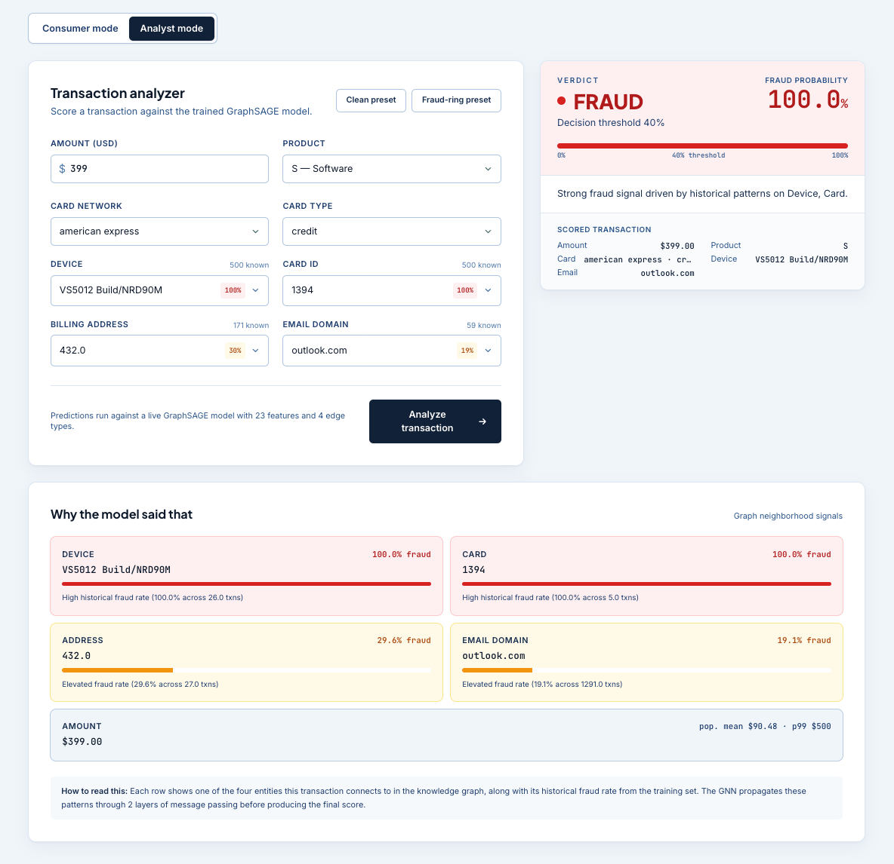
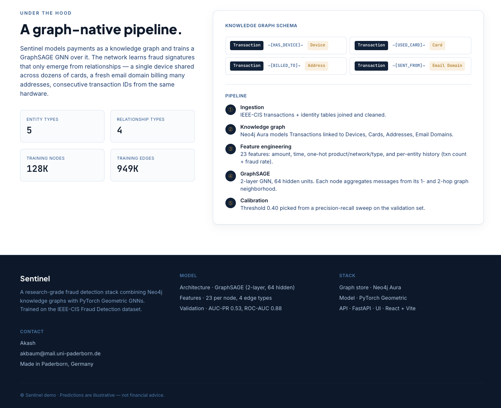
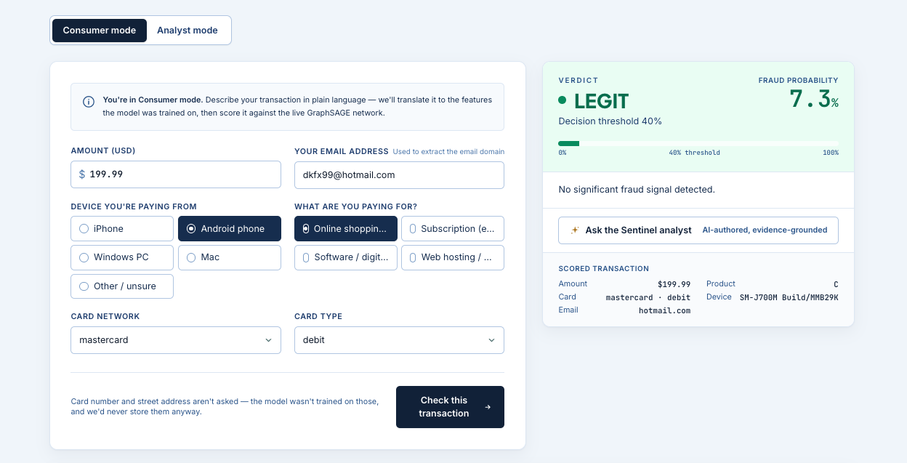
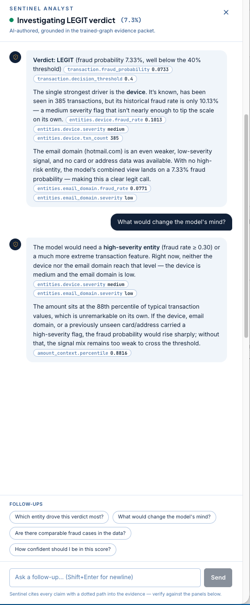

# Fraud Detection with Knowledge Graphs

End-to-end fraud detection system that combines **Neo4j knowledge graphs** with **Graph Neural Networks (GNNs)** to detect fraudulent transactions by learning from both transaction features and relational patterns in the data.

---

## Table of Contents

- [Why Knowledge Graphs for Fraud Detection?](#why-knowledge-graphs-for-fraud-detection)
- [Project Architecture](#project-architecture)
- [Setup](#setup)
- [Step 1 — Download the Dataset](#step-1--download-the-dataset)
- [Step 2 — Provision Neo4j Aura](#step-2--provision-neo4j-aura)
- [Step 3 — Import CSV into Neo4j](#step-3--import-csv-into-neo4j)
- [Step 4 — Explore the Graph](#step-4--explore-the-graph)
- [Step 5 — Pull Graph into Python](#step-5--pull-graph-into-python)
- [Step 6 — Build the PyG Graph Object](#step-6--build-the-pyg-graph-object)
- [Step 7 — Train the GNN](#step-7--train-the-gnn)
- [Step 8 — Evaluate](#step-8--evaluate)
- [Step 9 — Serve the Model (Web App)](#step-9--serve-the-model-web-app)
- [Step 10 — LLM Explainer (RAG over the Graph)](#step-10--llm-explainer-rag-over-the-graph)
- [Running the Pipeline](#running-the-pipeline)
- [Results](#results)
- [Project Structure](#project-structure)
- [Future Work](#future-work)

---

## Why Knowledge Graphs for Fraud Detection?

Traditional fraud detection treats every transaction as an isolated row in a table. This misses the most important signal in fraud: **relationships between entities**.

Consider a row-by-row view:

| txn_id | card_id | device_id | amount | fraud? |
|--------|---------|-----------|--------|--------|
| T_01   | C_001   | D_77      | 50     | No     |
| T_02   | C_002   | D_77      | 30     | No     |
| T_03   | C_004   | D_77      | 20     | No     |

Each row looks clean. But viewed as a graph:

```
Card_001 ──┐
Card_002 ──┼──► Device_77   ← same device, multiple different cards
Card_004 ──┘
```

This is a classic **card testing fraud pattern** — only visible when the data is modelled relationally.

Knowledge graphs make these structural patterns first-class citizens. Combined with Graph Neural Networks, the model can learn fraud signatures that flat tabular models cannot.

---

## Project Architecture

The pipeline has seven distinct layers:

```
┌─────────────────────────────────────────────────────────┐
│  ① Data Sources    (Kaggle IEEE-CIS Fraud Dataset)      │
├─────────────────────────────────────────────────────────┤
│  ② Preprocessing   (clean, dedupe, normalise)           │
├─────────────────────────────────────────────────────────┤
│  ③ Knowledge Graph (Neo4j Aura — nodes + edges)         │
├─────────────────────────────────────────────────────────┤
│  ④ Graph Queries   (baseline fraud pattern detection)   │
├─────────────────────────────────────────────────────────┤
│  ⑤ GNN Model       (PyTorch Geometric — GraphSAGE)      │
├─────────────────────────────────────────────────────────┤
│  ⑥ LLM Layer       (RAG over graph for explanations)  │
├─────────────────────────────────────────────────────────┤
│  ⑦ Output          (fraud scores + explanations)        │
└─────────────────────────────────────────────────────────┘

```

### Graph Schema

The knowledge graph models five entity types connected by four relationship types:


| Relationship   | From        | To           | Source field        |
|----------------|-------------|--------------|---------------------|
| `HAS_DEVICE`   | Transaction | Device       | `DeviceInfo`        |
| `BILLED_TO`    | Transaction | Address      | `addr1`             |
| `SENT_FROM`    | Transaction | Email Domain | `P_emaildomain`     |
| `USED_CARD`    | Transaction | Card         | `card1`             |

---

## Setup

### Requirements

- Python 3.11 (newer versions may break PyG)
- Neo4j Aura account (free tier works)
- ~2 GB free disk space

### Create the conda environment

```bash
conda create --name fraud_detection_neo4j python=3.11
conda activate fraud_detection_neo4j

pip install torch torch-geometric neo4j pandas scikit-learn python-dotenv
```

### Configure credentials

Create a `.env` file in the project root:

```bash
NEO4J_URI=neo4j+s://<your-instance-id>.databases.neo4j.io
NEO4J_USER=neo4j
NEO4J_PASSWORD=<your-password>
```

---

## Step 1 — Download the Dataset

We use the **IEEE-CIS Fraud Detection** dataset from Kaggle — one of the largest publicly available fraud datasets, originally released by Vesta Corporation.

### Download

```bash
# Install Kaggle CLI
pip install kaggle

# Set up Kaggle credentials (place kaggle.json in ~/.kaggle/)
# Get yours at: https://www.kaggle.com/settings → Create API Token

# Download
kaggle competitions download -c ieee-fraud-detection
unzip ieee-fraud-detection.zip -d data/
```

### What you get

Two CSV files relevant to this project:

**`train_transaction.csv`** (~590K rows, ~652 MB)
- `TransactionID` — unique transaction identifier
- `isFraud` — target label (0 or 1)
- `TransactionAmt` — transaction amount in USD
- `TransactionDT` — time offset from a reference datetime
- `ProductCD` — product category (W, H, C, S, R)
- `card1`–`card6` — card metadata (bank, type, country)
- `addr1`, `addr2` — billing address codes
- `P_emaildomain`, `R_emaildomain` — email domains
- `V1`–`V339` — anonymised engineered features by Vesta

**`train_identity.csv`** (~144K rows, ~25 MB)
- `TransactionID` — join key with the transaction table
- `DeviceType` — mobile or desktop
- `DeviceInfo` — device model string (e.g. "SM-A300H Build/LRX22G")
- `id_01`–`id_38` — anonymised network/browser identity signals

### Class distribution

Heavily imbalanced — typical of real-world fraud:

| Class | Count   | Percentage |
|-------|---------|-----------:|
| Legit | 569,877 | 96.5%      |
| Fraud | 20,663  |  3.5%      |

This imbalance drives several modelling choices later (weighted loss, AUC-PR over accuracy).

---

## Step 2 — Provision Neo4j Aura

We use **Neo4j Aura** (managed cloud Neo4j) so there's no local install.

1. Sign up at [console.neo4j.io](https://console.neo4j.io)
2. Click **"New Instance"** → select **AuraDB Free**
3. Save the auto-generated password — you only see it once
4. Wait ~60 seconds for provisioning
5. Copy the connection URI (looks like `neo4j+s://abc123.databases.neo4j.io`)

### Free tier limits

- 200K nodes
- 400K relationships
- Pauses after 3 days of inactivity (resume via console)

For this project, the limits are fine — we'll import ~48K transaction nodes and ~1.8K device nodes.

---

## Step 3 — Import CSV into Neo4j

We use Neo4j's **Data Importer** (the visual graph modelling tool inside Aura), not the LLM Graph Builder. The Data Importer is designed for structured CSV → graph mapping.

### Open the Data Importer

1. In the Aura console, click your instance
2. Click **"Import"** in the top menu
3. Drag both CSVs into the Data Sources panel

### Define the graph model

**Transaction node** (from `train_transaction.csv`):

| Field         | Type    | Role        |
|---------------|---------|-------------|
| TransactionID | integer | **Node ID** |
| isFraud       | boolean | Property    |
| TransactionAmt| float   | Property    |
| TransactionDT | integer | Property    |
| ProductCD     | string  | Property    |

We deliberately **skip the V1–V339 features**. They're anonymised floats that work better as features in the GNN's feature matrix than as Neo4j node properties.

**Device node** (from `train_identity.csv`):

| Field         | Type    | Role        |
|---------------|---------|-------------|
| DeviceInfo    | string  | **Node ID** |
| DeviceType    | string  | Property    |

Using `DeviceInfo` as the node ID — not `TransactionID` — is critical. It causes multiple transactions sharing the same device to **merge into one node**, which is exactly what makes shared-device fraud patterns visible.

**Relationship**:

```
(Transaction)-[:HAS_DEVICE]->(Device)
```

- From node: Transaction (matched by `TransactionID`)
- To node: Device (matched by `DeviceInfo`)
- Join column: `TransactionID` in the identity CSV

### Run the import

Click **Run Import**. Expect ~6 minutes. The Transaction node import may hit a `SessionExpired` error around 60 seconds — this is common for large files but the data still imports successfully. Verify with:

```cypher
MATCH (n) RETURN labels(n)[0] AS type, count(n) AS total
```

Expected output:

| type        | total  |
|-------------|-------:|
| Transaction | 47,268 |
| Device      | 1,786  |

And:

```cypher
MATCH ()-[r:HAS_DEVICE]->() RETURN count(r)
```

| count |
|------:|
| 54,870|

---

## Step 4 — Explore the Graph

Before training any model, we explore the graph to validate that the structure encodes fraud signals.


Visualised in Neo4j Bloom, transactions (olive) cluster around the devices (pink) they share — the dense hubs are exactly the high-volume, high-fraud devices uncovered below.

### Find suspicious devices

```cypher
MATCH (t:Transaction)-[:HAS_DEVICE]->(d:Device)
WITH d, count(t) AS txn_count,
     sum(CASE WHEN t.isFraud = true THEN 1 ELSE 0 END) AS fraud_count
WHERE txn_count > 3
RETURN d.DeviceInfo AS device, txn_count, fraud_count
ORDER BY fraud_count DESC
LIMIT 10
```

### Real findings from our run

| Device                   | Txn count | Fraud count | Fraud rate |
|--------------------------|----------:|------------:|-----------:|
| Windows                  | 21,713    | 700         | 3.2%       |
| iOS Device               | 11,327    | 329         | 2.9%       |
| **SM-A300H Build/LRX22G**| 77        | 70          | **90.9%**  |
| rv:57.0                  | 769       | 53          | 6.9%       |
| MacOS                    | 7,328     | 48          | 0.7%       |
| **KFFOWI Build/LVY48F**  | 36        | 29          | **80.6%**  |
| **Moto G (5) Plus**      | 31        | 25          | **80.6%**  |

The bolded devices are **dedicated fraud machines** — graph structure alone exposed them. A flat tabular query would not have found these patterns.

### Drill into the worst offender

```cypher
MATCH (t:Transaction)-[:HAS_DEVICE]->(d:Device)
WHERE d.DeviceInfo = "SM-A300H Build/LRX22G"
RETURN t.TransactionID, t.TransactionAmt, t.isFraud
ORDER BY t.isFraud DESC
LIMIT 20
```

This reveals **automated bot signatures**:
- Identical amounts (16.907, 30.633, 89.432) appearing multiple times
- Consecutive `TransactionID` values
- 70 of 77 transactions flagged as fraud

These patterns become the structural signals the GNN learns to detect at scale.

---

## Step 5 — Pull Graph into Python

We pull the graph from Aura into a pandas DataFrame for downstream processing.

### `pull_data.py`

### Why pickle the DataFrame?

So subsequent scripts in the pipeline don't need to re-query Aura. The cache is gitignored.

---

## Step 6 — Build the PyG Graph Object

PyTorch Geometric expects a `Data` object with:
- `x` — node feature matrix `[num_nodes, num_features]`
- `edge_index` — edge list `[2, num_edges]`
- `y` — node labels `[num_nodes]`
- Train/val/test masks

### `build_graph.py`

### Design choices explained

**23 node features**

Transaction nodes carry a rich feature matrix:

| Feature group          | Features                                                                 |
|------------------------|--------------------------------------------------------------------------|
| Transaction            | `amount_norm`, `timestamp_norm`                                          |
| Graph aggregates       | txn count + fraud rate for each of Device, Card, Address, Email Domain   |
| Product category       | one-hot (`prod_C`, `prod_H`, `prod_R`, `prod_S`)                         |
| Card network / type    | one-hot (`net_visa`, `net_mastercard`, …, `ctype_credit`, `ctype_debit`) |

Graph aggregate features (e.g. `device_fraud_rate_norm`) give each transaction node direct awareness of how fraudulent its neighbours have historically been, without leaking label information — they are computed from the full dataset before the train/val/test split is applied.

**Bidirectional edges**

GraphSAGE propagates information along edges. Without reverse edges, devices can't aggregate signal from their transactions. We add both directions explicitly.

**Device nodes carry no labels**

Devices have `y = -1` and are excluded from train/val/test masks. They participate in message passing but are not classification targets.

**Stratified split**

`RandomNodeSplit` randomises the train/val/test assignment. For production work, a temporal split (train on past, test on future) would be more realistic — fraud patterns shift over time.

---

## Step 7 — Train the GNN

We use **GraphSAGE** (Sample and Aggregate), a popular GNN architecture that scales well and handles inductive learning — i.e. it can generalise to unseen nodes at inference time.

### `graph_sage.py`

Two-layer GraphSAGE with 64 hidden units, dropout 0.5 for regularisation. The output is 2 logits per node (legit vs fraud) — softmax happens inside the loss.

### `train_gnn.py`

### Why these hyperparameters

**Learning rate `0.01`**

**Class weights `[1.0, sqrt(ratio)]`**
The fraud class is ~13× rarer. Using the raw ratio (13×) caused the model to collapse into predicting everything as fraud. Square-rooting it (~3.6×) provides a softer push that improves recall without destroying precision.

**`CrossEntropyLoss` over `BCELoss`**
Both are mathematically equivalent for binary tasks, but CrossEntropyLoss generalises trivially to multi-class — useful if we later add fraud subtypes (card testing, account takeover, etc.).

---

## Step 8 — Evaluate

For imbalanced fraud detection, **accuracy is misleading**. A trivial model predicting all-legit would score 96.5% accuracy while catching zero fraud. We focus on:

- **Recall (fraud class)** — how many real frauds did we catch?
- **Precision (fraud class)** — of our fraud predictions, how many were right?
- **F1 (fraud class)** — harmonic mean of the two
- **AUC-PR (average precision)** — the most reliable single metric for imbalanced binary classification

### `eval.py`

---

## Step 9 — Serve the Model (Web App)

A trained model is only useful if it can score live transactions. The repo
ships with a **FastAPI inference backend** and a **React frontend** ("Sentinel")
that together let either a customer or an analyst score any transaction against
the live GNN and see the supporting graph signals.



### Two audiences, one model

The IEEE-CIS dataset is **anonymized** — `card`/`address` IDs are internal
Vesta integers, not real card numbers or street addresses. A customer simply
doesn't know those values. The UI exposes two modes so both audiences can use
the same model:

- **Consumer mode** *(default)* — plain-language inputs: email, "iPhone / Android /
  Windows / Mac", and "what are you buying?". The backend translates these into
  the features the model was actually trained on, then shows the user exactly
  what it did so the mapping is transparent.
- **Analyst mode** — searchable dropdowns over the real entity IDs from the
  graph, annotated with each entity's historical fraud rate. This is the
  fraud-analyst workbench view.

### How inference works

Single-transaction inference on a GNN is non-trivial: the model's predictive
power comes from message passing over the entity graph, not just the row's own
features. The backend handles this by:

1. Loading `data/df.pkl`, replaying the deterministic train split, and re-fitting
   the scaler + entity-stats lookups exactly as `build_graph.py` does at
   training time.
2. For each request, appending the new transaction as a node onto the cached
   graph and wiring bidirectional edges to whichever existing Device / Card /
   Address / Email Domain nodes the request names.
3. Running a fresh forward pass and reading the softmax at the new node's index.

Unseen entities (e.g. a brand-new device) get zero-history features and no
graph link — the GNN then has to rely on the row's own features (amount,
product, card metadata) without neighbourhood context.

### Consumer mode in action

A $21 000 web-hosting purchase from a Windows PC scores 95% fraud — driven by
the wildly out-of-distribution amount and the elevated fraud rate on the
mapped `Windows` device fingerprint:



After every prediction, the UI shows **how it read your transaction** — the
translation from plain-language inputs into the model's vocabulary — followed
by the per-entity signals that drove the score:



### Analyst mode

For stakeholders or analysts, the dropdown view operates directly on the
graph's anonymized IDs and includes one-click **Clean preset** / **Fraud-ring
preset** buttons to demo extremes. Below: hand-picking a 100%-historical-fraud
device + card scores 100% fraud with all four entity signals lit up:



### Under the hood (on the page itself)

The site also documents the pipeline and graph schema for visitors who want
to understand *why* the model works, not just *that* it does:



### Backend

```bash
pip install -r requirements.txt          # adds fastapi + uvicorn
uvicorn backend.app:app --reload --port 8000
```

Endpoints:

| Method | Path                            | Purpose                                                |
|--------|---------------------------------|--------------------------------------------------------|
| GET    | `/api/health`                   | Liveness probe                                         |
| GET    | `/api/options`                  | Product / card-network / card-type categories          |
| GET    | `/api/entities/{kind}`          | Catalog of known devices / cards / addresses / emails  |
| POST   | `/api/predict`                  | Score a transaction (analyst payload)                  |
| GET    | `/api/consumer/options`         | Lay-friendly dropdown values (device & merchant categories) |
| POST   | `/api/consumer/predict`         | Score a consumer-style transaction; response includes the input→feature translation |

### Frontend

A Vite + React + Tailwind app under `frontend/`, trust-blue corporate styling.

```bash
cd frontend
npm install
npm run dev          # http://localhost:5173
```

The Vite dev server proxies `/api/*` to `http://127.0.0.1:8000`, so the two
processes run side-by-side during development.

### Features

- **Mode toggle** (Consumer / Analyst) at the top of the analyzer — same model,
  two surfaces.
- **Consumer translation panel** — transparent table of what the user said
  vs. what the model saw, with an honest caveat about the anonymized dataset.
- **Searchable dropdowns** (Analyst mode) of real device / card / address /
  email values, each annotated with its historical fraud rate.
- **Verdict card** with fraud probability, decision threshold, and a coloured
  confidence bar.
- **Explanation panel** showing per-entity fraud history, an amount-vs-population
  check, and a plain-English summary — readable as a fraud-analyst report
  rather than a black-box score.
- **Presets** (`Clean` / `Fraud-ring`, Analyst mode) one-click populate the
  form with extreme examples for quick demos.

---

## Step 10 — LLM Explainer (RAG over the Graph)

A GNN gives you a score. It doesn't give you a story an operator can act
on. **Sentinel Analyst** is a streaming chat layer powered by an open-source
LLM (**DeepSeek V4 Pro** by default, served via the **HuggingFace Router**)
that explains every prediction in plain language — grounded in the same
trained-graph statistics the GNN itself uses, with inline citations so the
operator can verify every claim.

### In action

Every prediction sprouts an **"Ask the Sentinel analyst"** button on the
verdict card. Clicking it opens a streaming chat drawer that explains the
verdict and accepts follow-up questions:



The drawer streams an evidence-grounded explanation token-by-token, with
**inline citation chips** (e.g. `entities.device.fraud_rate`) the analyst
can hover to verify against the same data shown in the panels below. The
example below shows a multi-turn investigation of a borderline-LEGIT
verdict — including a follow-up *"What would change the model's mind?"*
and the suggested follow-up chips at the bottom:



### The flow

```
Flagged transaction + GNN prediction
        ↓
build_evidence() → structured fact packet
        ↓                      pulled from:
        ├─ entities          • engine.context['entity_stats']  (training-set
        ├─ peers               counts + fraud rates per entity)
        ├─ amount_context    • engine.df  (peer transactions, distribution)
        └─ population
        ↓
DeepSeek (streaming via HF Router, OpenAI-compatible API)
        ↓
Markdown with inline citations: [device.fraud_rate=1.0]
        ↓
React drawer renders prose + citation chips
```

The evidence packet is the **only** thing the LLM is allowed to cite. The
system prompt makes this explicit ("facts outside this block are off-
limits") and instructs the model to use dotted citation paths into the
JSON — e.g. `[device.fraud_rate=1.0]`, `[peers.device.txn_3105398.fraud=true]`.
The frontend renders each citation as a chip with a tooltip; a curious
analyst can verify the claim against the same data shown in the
ExplanationPanel directly below.

### Why this design

| Decision | Rationale |
|---|---|
| **Retrieval from `engine.df`, not live Neo4j** | The df is the materialized projection of the graph and is already in memory — retrieval is microseconds, not a round-trip. A future phase can layer in live Neo4j queries for cross-session vector search. |
| **Pre-written facts, no text-to-Cypher** | Text-to-Cypher adds a hallucination layer on top of an already-hallucinatory layer. Phase A is strictly grounded; ad-hoc Cypher is Phase C with strict allow-list validation. |
| **Markdown streaming, not structured JSON** | Chat UX needs first-token latency. The structured-output-via-schema path streams as one big block at the end; markdown with inline citations gives the same audit guarantees in a chat-native shape. |
| **OpenAI SDK pointed at HF Router** | DeepSeek + other open-source models are routed through `router.huggingface.co/v1` with the standard OpenAI client. Swapping to Llama, Mixtral, or any other HF-routed model is a single env var (`EXPLAINER_MODEL`) — no code changes. |
| **Stateless server** | The client holds the conversation history and sends it back each turn. No per-thread state on the server; horizontal scaling is trivial. |

### Implementation details

This section is for anyone who wants to read the code or replicate the
pattern. Three concrete things: what the evidence looks like, what call
the backend makes, and how streaming flows end-to-end.

#### 1. The evidence packet

[backend/llm/retrieval.py](backend/llm/retrieval.py) builds a single dict
the LLM is allowed to cite from. For the fraud-ring preset
(`device="VS5012 Build/NRD90M"`, $1.50, `email_domain="gmail.com"`) it
looks like this (truncated):

```json
{
  "transaction": {
    "amount": 1.5, "product": "C", "card_network": "visa", "card_type": "credit",
    "verdict": "FRAUD", "fraud_probability": 0.81, "decision_threshold": 0.4
  },
  "entities": {
    "device":       { "present": true,  "known": true,  "value": "VS5012 Build/NRD90M",
                      "txn_count": 26, "fraud_rate": 1.0, "fraud_count": 26, "severity": "high" },
    "card":         { "present": false, "known": false, "value": null },
    "address":      { "present": false, "known": false, "value": null },
    "email_domain": { "present": true,  "known": true,  "value": "gmail.com",
                      "txn_count": 31199, "fraud_rate": 0.1052, "fraud_count": 3283, "severity": "medium" }
  },
  "peers": {
    "device": [
      { "txn_id": 3383086, "amount": 37.46, "fraud": true, "product": "C" },
      { "txn_id": 3383091, "amount": 37.46, "fraud": true, "product": "C" }
      // … up to 5
    ]
  },
  "amount_context": {
    "value": 1.5, "percentile": 0.0013, "mean": 90.48,
    "median": 50.0, "p95": 240.0, "p99": 500.0, "max": 31937.39
  },
  "population": { "total_transactions": 118666, "fraud_rate_overall": 0.0725 }
}
```

Every leaf in this tree is **a fact with a stable path**. When the LLM
writes `[device.fraud_rate=1.0]`, the frontend can resolve `device →
entities.device → fraud_rate` and verify `1.0` against the same source
of truth the ExplanationPanel below already shows.

Unseen entities (here `card` and `address`) get `present: false` rather
than being omitted — so the model can explicitly attribute *absence* of
context rather than silently leaving them out.

#### 2. The LLM call (OpenAI SDK → HF Router)

[backend/llm/client.py](backend/llm/client.py) does exactly this, simplified:

```python
from openai import AsyncOpenAI

client = AsyncOpenAI(
    base_url="https://router.huggingface.co/v1",   # EXPLAINER_BASE_URL
    api_key=os.environ["HF_TOKEN"],
)

stream = await client.chat.completions.create(
    model="deepseek-ai/DeepSeek-V4-Pro:fireworks-ai",   # EXPLAINER_MODEL
    messages=[
        {"role": "system",  "content": BASE_SYSTEM + "\n\n" + render_evidence_block(evidence)},
        *messages,                                       # full conversation history
    ],
    max_tokens=2048,
    stream=True,
    stream_options={"include_usage": True},
)

async for chunk in stream:
    if chunk.usage is not None:
        usage = chunk.usage                              # arrives in the final chunk
    if chunk.choices:
        delta = chunk.choices[0].delta
        if delta and delta.content:
            yield {"type": "text", "content": delta.content}
```

Three things worth noting:

- **Single system message.** Unlike Anthropic's array-of-blocks shape,
  the OpenAI/HF Router API takes one string. Base instructions + evidence
  get concatenated.
- **`stream_options.include_usage`** is what makes the final chunk carry
  `prompt_tokens` / `completion_tokens` — without it, token usage is
  unavailable on streaming responses.
- **Errors are yielded, not raised.** `AuthenticationError`, `RateLimitError`,
  and `APIStatusError` become `{type: "error", message: ...}` events on
  the SSE stream so the chat UI can render them as a graceful card
  instead of a broken connection.

#### 3. The SSE wire format

[backend/app.py](backend/app.py)'s `/api/explain` wraps the generator in
a `StreamingResponse(media_type="text/event-stream")` and emits one event
per line, framed by a blank line:

```
data: {"type": "text", "content": "**"}\n\n
data: {"type": "text", "content": "V"}\n\n
data: {"type": "text", "content": "erd"}\n\n
...
data: {"type": "done", "usage": {"input_tokens": 1484, "output_tokens": 425}}\n\n
```

On the frontend, [api.js](frontend/src/api.js)'s `streamExplain()` is an
**async generator** that reads the `fetch` body as a `ReadableStream`,
buffers partial lines until it sees `\n\n`, and yields each parsed event:

```js
const reader = res.body.getReader()
const decoder = new TextDecoder()
let buffer = ''

while (true) {
  const { done, value } = await reader.read()
  if (done) break
  buffer += decoder.decode(value, { stream: true })

  let idx
  while ((idx = buffer.indexOf('\n\n')) !== -1) {
    const chunk = buffer.slice(0, idx); buffer = buffer.slice(idx + 2)
    for (const line of chunk.split('\n')) {
      if (line.startsWith('data: ')) {
        yield JSON.parse(line.slice(6))
      }
    }
  }
}
```

[ExplainerChat.jsx](frontend/src/components/ExplainerChat.jsx) consumes
this with `for await (const ev of stream)` and appends each `text` event
to the currently-streaming assistant bubble. An `AbortController` passed
to `fetch` lets the **Stop** button cancel mid-stream cleanly.

#### 4. Conversation state — stateless server, client holds history

There is **no per-thread state on the server**. Every request to
`/api/explain` carries the entire conversation:

```json
{
  "payload":   { ... },                       // the transaction (unchanged)
  "prediction": { ... },                      // the GNN's verdict (unchanged)
  "messages": [
    { "role": "user",      "content": "..." },
    { "role": "assistant", "content": "..." },
    { "role": "user",      "content": "What about the address signal?" }
  ]
}
```

The server rebuilds the evidence packet from the same `payload` +
`prediction` each turn (it's cheap — pandas lookups on an in-memory df),
prepends the system message, and runs the stream. This means:

- **No session store, no Redis, no cleanup job.** Horizontal scaling is
  trivial.
- **Cancellation is automatic.** Close the SSE connection and the
  conversation simply ends — there's no orphaned state to garbage-
  collect.
- **The first turn is special.** When `messages` is empty, the server
  injects a canonical "give me the headline" prompt
  ([prompts.py](backend/llm/prompts.py) `INITIAL_USER_PROMPT`) so the
  initial explanation always has the same shape.

#### 5. The citation chip renderer

[markdown.js](frontend/src/components/markdown.js) is a 60-line custom
markdown subset — paragraphs, `**bold**`, `*italic*`, `` `code` ``,
bulleted lists, and the citation regex:

```js
const CITATION_RE = /\[([a-z][a-z0-9_]*(?:\.[a-z0-9_]+)+)(?:=([^\]]+))?\]/gi
```

Matched citations become hoverable chips that show the dotted path as a
tooltip. The renderer HTML-escapes input before applying replacements,
so it's safe to feed directly to `dangerouslySetInnerHTML`. **No npm
dependency** for markdown — the bundle stayed under 60 KB gzipped.

#### 6. Honest limits of Phase A

- **The citation contract is enforced by prompt, not by code.** The
  system prompt says "if a path doesn't resolve, you've hallucinated."
  Phase C will add a server-side validator that parses citations and
  rejects responses whose paths don't resolve in the evidence dict.
- **Retrieval is from the cached df, not live Neo4j.** Same data
  (df is the materialized graph), but means we can't (yet) query
  cross-session: "what other devices share this card today?" needs a
  live Cypher call.
- **No streaming "thinking" indicator.** DeepSeek V4 Pro doesn't expose
  separate reasoning chunks via the HF Router; if you swap in a
  reasoning model that does, the SSE shape would need a `{type: "thinking"}`
  event variant.

### Setup

The explainer needs a HuggingFace token. Get one at
[huggingface.co/settings/tokens](https://huggingface.co/settings/tokens),
then add it to your `.env` file.

**If you don't have a `.env` yet** (fresh clone):

```bash
cp .env.example .env       # creates .env from the committed template
# then edit .env and paste your token
```

**If you already have a `.env`** (e.g. you've been using Neo4j Aura): just
**append** the line below — don't overwrite the file:

```bash
HF_TOKEN=hf_…              # paste your real token here
```

Optional knobs (all have sensible defaults):

```bash
# EXPLAINER_MODEL=deepseek-ai/DeepSeek-V4-Pro:fireworks-ai   # default
# EXPLAINER_MODEL=meta-llama/Llama-3.3-70B-Instruct:together # alt open model
# EXPLAINER_BASE_URL=https://router.huggingface.co/v1        # change provider
# EXPLAINER_API_KEY_ENV=HF_TOKEN                             # which env var holds the key
# EXPLAINER_MAX_TOKENS=2048
```

Restart `uvicorn` so it picks up the new env var. Without the token the
chat panel shows a graceful **"Analyst unavailable"** message — the rest
of the app still works.

The OpenAI-compatible API surface means **any** model exposed through the
HF Router (or any other OpenAI-compatible endpoint — Together, Fireworks,
a local Ollama at `http://localhost:11434/v1`) drops in via the
`EXPLAINER_BASE_URL` / `EXPLAINER_MODEL` env vars without a code change.

### Endpoints

| Method | Path                       | Purpose                                                |
|--------|----------------------------|--------------------------------------------------------|
| POST   | `/api/explain`             | **SSE stream** of `{type:"text", content}` events ending in `{type:"done", usage}` |
| POST   | `/api/explain/evidence`    | The evidence packet alone (no LLM call) — useful for debugging citations |

Request body for both:

```json
{
  "payload":   { "amount": 1.5, "product": "C", "device": "VS5012 Build/NRD90M", ... },
  "prediction": { "verdict": "FRAUD", "fraud_probability": 0.81, "threshold": 0.4 },
  "messages":  [ ]   // empty for first turn; full history for follow-ups
}
```

### Frontend

Click **"Ask the Sentinel analyst"** on the verdict card to open a
right-side drawer. The drawer:

- Streams the initial explanation token-by-token
- Renders inline citation chips (hover for the dotted path)
- Offers suggested follow-up prompts after the first answer
- Supports free-form follow-up questions (multi-turn conversation)
- Lets the operator interrupt a long answer with a **Stop** button

### Phase B + C (future work)

- **Pattern-library Cypher** — pre-written motif queries (`card_testing.cypher`,
  `shared_device_ring.cypher`) committed under `backend/motifs/`, run against
  live Neo4j, results attached to the evidence packet as labelled kits.
- **Similar-cases retrieval** — Neo4j 5.x vector index over confirmed-fraud
  GNN embeddings, top-K nearest neighbours surfaced in evidence.
- **Counterfactuals** — *"if you'd used a different device, p(fraud) drops
  95% → 5%"* — possible because the inference path can mutate the graph at
  request time.
- **Cite-only validator** — parse the model's citation paths, reject any
  that don't resolve in the evidence dict, retry with a clarifying message.
- **Cypher-tool agent loop** — ad-hoc analyst questions ("show me all txns
  from this device this week") via a strictly allow-listed Cypher tool.

---

## Running the Pipeline

A single orchestrator runs everything in order:

### `run_pipeline.py`

```bash
python run_pipeline.py
```

This executes:

1. `pull_data.py` — fetches the graph from Aura → `data/df.pkl`
2. `train_gnn.py` — builds PyG graph, trains GraphSAGE → `data/model.pt`
3. `eval.py` — loads model, prints metrics

Each stage is timed individually and the pipeline halts on any failure.

---

## Results

Current model performance on the test set (20% holdout, 23 733 nodes — 22 012 legit, 1 721 fraud), evaluated at threshold = 0.4:

| Metric            | Value   |
|-------------------|--------:|
| Fraud Recall      | 63.7%   |
| Fraud Precision   | 40.4%   |
| Fraud F1          | 49.5%   |
| ROC-AUC           | 0.8847  |
| AUC-PR            | 0.5269  |

### Threshold sweep (fraud class)

| Threshold | Precision | Recall | F1    |
|----------:|----------:|-------:|------:|
| 0.2       | 29.2%     | 74.6%  | 42.0% |
| 0.3       | 37.8%     | 64.6%  | 47.7% |
| **0.4**   | **40.4%** | **63.7%** | **49.5%** |
| 0.5       | 54.9%     | 47.6%  | 51.0% |
| 0.6       | 62.9%     | 39.2%  | 48.3% |
| 0.7       | 71.4%     | 31.8%  | 44.0% |

### Confusion matrix (threshold = 0.4)

|                 | Pred Legit | Pred Fraud |
|-----------------|----------:|-----------:|
| **True Legit**  |   20 396  |    1 616   |
| **True Fraud**  |      625  |    1 096   |

### Interpretation

ROC-AUC of **0.88** and AUC-PR of **0.53** (vs. random baseline of ~0.075) confirm that multi-relational graph structure carries strong discrimination signal. At threshold 0.4, the model catches **64% of all fraud** — a deliberate precision–recall trade-off that prioritises recall for a review queue where missing fraud is more costly than a false positive.

The dramatic improvement over the earlier single-feature model (AUC-PR 0.11 → 0.53, ROC-AUC 0.61 → 0.88) is driven by two factors: richer node features (23 vs 1) and four relationship types (`HAS_DEVICE`, `USED_CARD`, `BILLED_TO`, `SENT_FROM`) vs the original single edge type.

### Known limitations

1. **No temporal split.** Real-world performance against future fraud could differ; a `TransactionDT`-based split is the next priority.
2. **Graph aggregates computed on full dataset.** `device_fraud_rate_norm` etc. are computed before the train/val/test split, which gives device-level leakage. A production system would compute these only from the training window.
3. **V1–V339 Vesta features unused.** Including even a PCA-reduced subset should further improve AUC-PR.
4. **No merchant or purchaser email node.** `R_emaildomain` is not yet modelled.

---

## Project Structure

```
fraud_detection_neo4j/
├── README.md
├── Nodes_rels.png           # graph schema diagram
├── bloom-visualisation.png  # Neo4j Bloom view of the graph
├── webapp-*.png             # Sentinel web-app screenshots
├── .env                     # credentials (gitignored)
├── .gitignore
├── requirements.txt
├── config.py                # Neo4j driver factory
├── graph_sage.py            # GraphSAGE model definition
├── baseline.py              # tabular baseline (XGBoost / LightGBM)
├── build_graph.py           # df → PyG Data object (+ inference context)
├── pull_data.py             # Aura → df.pkl
├── train_gnn.py             # training loop
├── eval.py                  # metrics
├── run_pipeline.py          # orchestrator
├── backend/                 # FastAPI inference server
│   ├── app.py               # routes: /options, /entities, /predict, /consumer/*, /explain
│   ├── inference.py         # Engine + Consumer→model mapping
│   └── llm/                 # LLM explainer (Claude, RAG over the graph)
│       ├── client.py        # Anthropic streaming + prompt caching
│       ├── retrieval.py     # build_evidence() — facts the model may cite
│       └── prompts.py       # system prompt + citation contract
├── frontend/                # Vite + React + Tailwind "Sentinel" UI
│   ├── index.html
│   ├── package.json
│   ├── tailwind.config.js
│   ├── vite.config.js
│   └── src/
│       ├── App.jsx                       # mode toggle + page layout
│       ├── api.js
│       └── components/
│           ├── Header.jsx
│           ├── Hero.jsx
│           ├── ConsumerForm.jsx          # lay-friendly form (default mode)
│           ├── TransactionForm.jsx       # analyst form (anonymized IDs)
│           ├── EntitySelect.jsx          # searchable dropdown w/ fraud-rate pills
│           ├── VerdictCard.jsx
│           ├── ExplanationPanel.jsx
│           ├── TranslationPanel.jsx      # consumer→model mapping display
│           ├── ExplainerChat.jsx         # streaming LLM analyst drawer
│           ├── markdown.js               # tiny markdown + citation renderer
│           ├── ModelSection.jsx
│           └── Footer.jsx
└── data/
    ├── df.pkl               # cached graph data (gitignored)
    ├── graph.pt             # PyG Data object (gitignored)
    └── model.pt             # trained model weights (gitignored)
```

---

## Future Work

**Add richer node features**
Pull the V1–V339 Vesta features as a normalised feature matrix for the Transaction nodes. Even a subset would significantly improve discrimination.

**Add more relationship types**
Model `Card`, `Address`, `Email Domain`, and `Merchant` as separate node types. Fraud rings are most visible across multiple edge types — a card and an address shared across many users is a stronger signal than a shared device alone.

**Engineer graph features**
Compute per-device features (transaction count, average amount, time-window velocity) and attach them to device nodes. Currently devices have zero features and only contribute via structural message passing.

**Temporal split**
Replace `RandomNodeSplit` with a split based on `TransactionDT`. Train on early transactions, validate on middle, test on latest — closer to a real deployment scenario.

**LLM explainability layer**
Build a RAG pipeline over the Neo4j graph using LangChain. When the GNN flags a transaction, retrieve its subgraph (connected device, other transactions on the device, etc.) and have an LLM generate a human-readable explanation:

> *"Transaction T_3076019 was flagged because its device SM-A300H Build/LRX22G has a 90% historical fraud rate, with 70 confirmed frauds across 77 transactions, many showing identical amounts and consecutive transaction IDs consistent with automated card testing."*

This is the differentiating layer that makes the system production-useful for fraud analysts.

**Threshold tuning**
Sweep the decision threshold (`P(fraud)`) from 0.5 to 0.95 and pick the operating point that matches business cost ratios — e.g. cost of investigating a false positive vs cost of missing a real fraud.

---

## Acknowledgements

- **IEEE-CIS Fraud Detection** dataset, provided by Vesta Corporation
- **Neo4j Aura** for managed graph database hosting
- **PyTorch Geometric** for GNN tooling
