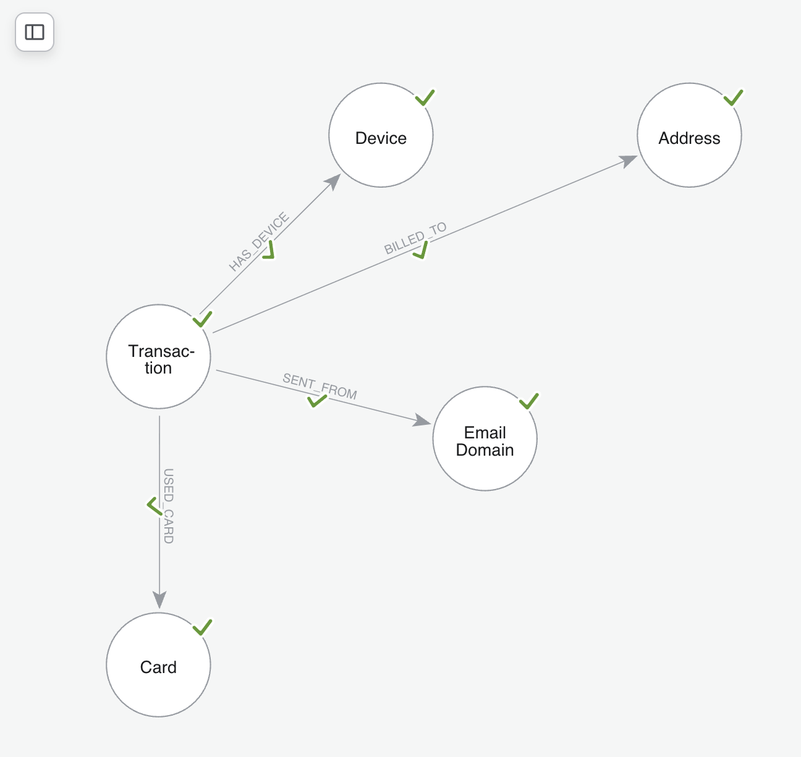
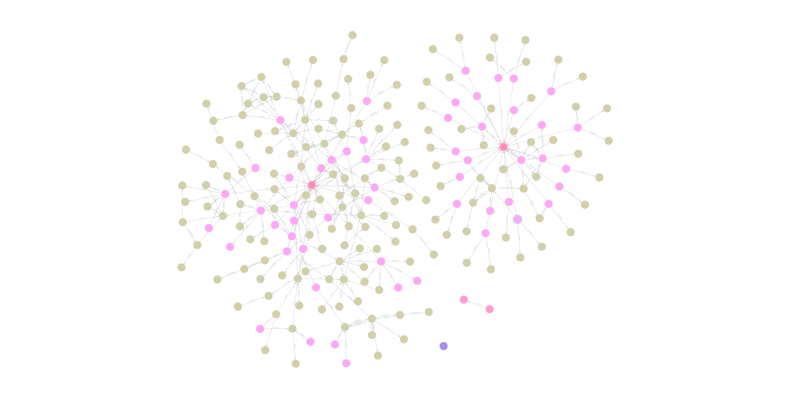

# Fraud Detection with Knowledge Graphs

End-to-end fraud detection system that combines **Neo4j knowledge graphs** with **Graph Neural Networks (GNNs)** to detect fraudulent transactions by learning from both transaction features and relational patterns in the data.

---

## Table of Contents

- [Why Knowledge Graphs for Fraud Detection?](#why-knowledge-graphs-for-fraud-detection)
- [Project Architecture](#project-architecture)
- [Setup](#setup)
- [Step 1 — Download the Dataset](#step-1--download-the-dataset)
- [Step 2 — Provision Neo4j Aura](#step-2--provision-neo4j-aura)
- [Step 3 — Import CSV into Neo4j](#step-3--import-csv-into-neo4j)
- [Step 4 — Explore the Graph](#step-4--explore-the-graph)
- [Step 5 — Pull Graph into Python](#step-5--pull-graph-into-python)
- [Step 6 — Build the PyG Graph Object](#step-6--build-the-pyg-graph-object)
- [Step 7 — Train the GNN](#step-7--train-the-gnn)
- [Step 8 — Evaluate](#step-8--evaluate)
- [Running the Pipeline](#running-the-pipeline)
- [Results](#results)
- [Project Structure](#project-structure)
- [Future Work](#future-work)

---

## Why Knowledge Graphs for Fraud Detection?

Traditional fraud detection treats every transaction as an isolated row in a table. This misses the most important signal in fraud: **relationships between entities**.

Consider a row-by-row view:

| txn_id | card_id | device_id | amount | fraud? |
|--------|---------|-----------|--------|--------|
| T_01   | C_001   | D_77      | 50     | No     |
| T_02   | C_002   | D_77      | 30     | No     |
| T_03   | C_004   | D_77      | 20     | No     |

Each row looks clean. But viewed as a graph:

```
Card_001 ──┐
Card_002 ──┼──► Device_77   ← same device, multiple different cards
Card_004 ──┘
```

This is a classic **card testing fraud pattern** — only visible when the data is modelled relationally.

Knowledge graphs make these structural patterns first-class citizens. Combined with Graph Neural Networks, the model can learn fraud signatures that flat tabular models cannot.

---

## Project Architecture

The pipeline has seven distinct layers:

```
┌─────────────────────────────────────────────────────────┐
│  ① Data Sources    (Kaggle IEEE-CIS Fraud Dataset)      │
├─────────────────────────────────────────────────────────┤
│  ② Preprocessing   (clean, dedupe, normalise)           │
├─────────────────────────────────────────────────────────┤
│  ③ Knowledge Graph (Neo4j Aura — nodes + edges)         │
├─────────────────────────────────────────────────────────┤
│  ④ Graph Queries   (baseline fraud pattern detection)   │
├─────────────────────────────────────────────────────────┤
│  ⑤ GNN Model       (PyTorch Geometric — GraphSAGE)      │
├─────────────────────────────────────────────────────────┤
│  ⑥ LLM Layer       (RAG over graph for explanations)*   │
├─────────────────────────────────────────────────────────┤
│  ⑦ Output          (fraud scores + explanations)        │
└─────────────────────────────────────────────────────────┘
* planned — not yet implemented
```

### Graph Schema

The knowledge graph models five entity types connected by four relationship types:



| Relationship   | From        | To           | Source field        |
|----------------|-------------|--------------|---------------------|
| `HAS_DEVICE`   | Transaction | Device       | `DeviceInfo`        |
| `BILLED_TO`    | Transaction | Address      | `addr1`             |
| `SENT_FROM`    | Transaction | Email Domain | `P_emaildomain`     |
| `USED_CARD`    | Transaction | Card         | `card1`             |

---

## Setup

### Requirements

- Python 3.11 (newer versions may break PyG)
- Neo4j Aura account (free tier works)
- ~2 GB free disk space

### Create the conda environment

```bash
conda create --name fraud_detection_neo4j python=3.11
conda activate fraud_detection_neo4j

pip install torch torch-geometric neo4j pandas scikit-learn python-dotenv
```

### Configure credentials

Create a `.env` file in the project root:

```bash
NEO4J_URI=neo4j+s://<your-instance-id>.databases.neo4j.io
NEO4J_USER=neo4j
NEO4J_PASSWORD=<your-password>
```

---

## Step 1 — Download the Dataset

We use the **IEEE-CIS Fraud Detection** dataset from Kaggle — one of the largest publicly available fraud datasets, originally released by Vesta Corporation.

### Download

```bash
# Install Kaggle CLI
pip install kaggle

# Set up Kaggle credentials (place kaggle.json in ~/.kaggle/)
# Get yours at: https://www.kaggle.com/settings → Create API Token

# Download
kaggle competitions download -c ieee-fraud-detection
unzip ieee-fraud-detection.zip -d data/
```

### What you get

Two CSV files relevant to this project:

**`train_transaction.csv`** (~590K rows, ~652 MB)
- `TransactionID` — unique transaction identifier
- `isFraud` — target label (0 or 1)
- `TransactionAmt` — transaction amount in USD
- `TransactionDT` — time offset from a reference datetime
- `ProductCD` — product category (W, H, C, S, R)
- `card1`–`card6` — card metadata (bank, type, country)
- `addr1`, `addr2` — billing address codes
- `P_emaildomain`, `R_emaildomain` — email domains
- `V1`–`V339` — anonymised engineered features by Vesta

**`train_identity.csv`** (~144K rows, ~25 MB)
- `TransactionID` — join key with the transaction table
- `DeviceType` — mobile or desktop
- `DeviceInfo` — device model string (e.g. "SM-A300H Build/LRX22G")
- `id_01`–`id_38` — anonymised network/browser identity signals

### Class distribution

Heavily imbalanced — typical of real-world fraud:

| Class | Count   | Percentage |
|-------|---------|-----------:|
| Legit | 569,877 | 96.5%      |
| Fraud | 20,663  |  3.5%      |

This imbalance drives several modelling choices later (weighted loss, AUC-PR over accuracy).

---

## Step 2 — Provision Neo4j Aura

We use **Neo4j Aura** (managed cloud Neo4j) so there's no local install.

1. Sign up at [console.neo4j.io](https://console.neo4j.io)
2. Click **"New Instance"** → select **AuraDB Free**
3. Save the auto-generated password — you only see it once
4. Wait ~60 seconds for provisioning
5. Copy the connection URI (looks like `neo4j+s://abc123.databases.neo4j.io`)

### Free tier limits

- 200K nodes
- 400K relationships
- Pauses after 3 days of inactivity (resume via console)

For this project, the limits are fine — we'll import ~48K transaction nodes and ~1.8K device nodes.

---

## Step 3 — Import CSV into Neo4j

We use Neo4j's **Data Importer** (the visual graph modelling tool inside Aura), not the LLM Graph Builder. The Data Importer is designed for structured CSV → graph mapping.

### Open the Data Importer

1. In the Aura console, click your instance
2. Click **"Import"** in the top menu
3. Drag both CSVs into the Data Sources panel

### Define the graph model

**Transaction node** (from `train_transaction.csv`):

| Field         | Type    | Role        |
|---------------|---------|-------------|
| TransactionID | integer | **Node ID** |
| isFraud       | boolean | Property    |
| TransactionAmt| float   | Property    |
| TransactionDT | integer | Property    |
| ProductCD     | string  | Property    |

We deliberately **skip the V1–V339 features**. They're anonymised floats that work better as features in the GNN's feature matrix than as Neo4j node properties.

**Device node** (from `train_identity.csv`):

| Field         | Type    | Role        |
|---------------|---------|-------------|
| DeviceInfo    | string  | **Node ID** |
| DeviceType    | string  | Property    |

Using `DeviceInfo` as the node ID — not `TransactionID` — is critical. It causes multiple transactions sharing the same device to **merge into one node**, which is exactly what makes shared-device fraud patterns visible.

**Relationship**:

```
(Transaction)-[:HAS_DEVICE]->(Device)
```

- From node: Transaction (matched by `TransactionID`)
- To node: Device (matched by `DeviceInfo`)
- Join column: `TransactionID` in the identity CSV

### Run the import

Click **Run Import**. Expect ~6 minutes. The Transaction node import may hit a `SessionExpired` error around 60 seconds — this is common for large files but the data still imports successfully. Verify with:

```cypher
MATCH (n) RETURN labels(n)[0] AS type, count(n) AS total
```

Expected output:

| type        | total  |
|-------------|-------:|
| Transaction | 47,268 |
| Device      | 1,786  |

And:

```cypher
MATCH ()-[r:HAS_DEVICE]->() RETURN count(r)
```

| count |
|------:|
| 54,870|

---

## Step 4 — Explore the Graph

Before training any model, we explore the graph to validate that the structure encodes fraud signals.



Visualised in Neo4j Bloom, transactions (olive) cluster around the devices (pink) they share — the dense hubs are exactly the high-volume, high-fraud devices uncovered below.

### Find suspicious devices

```cypher
MATCH (t:Transaction)-[:HAS_DEVICE]->(d:Device)
WITH d, count(t) AS txn_count,
     sum(CASE WHEN t.isFraud = true THEN 1 ELSE 0 END) AS fraud_count
WHERE txn_count > 3
RETURN d.DeviceInfo AS device, txn_count, fraud_count
ORDER BY fraud_count DESC
LIMIT 10
```

### Real findings from our run

| Device                   | Txn count | Fraud count | Fraud rate |
|--------------------------|----------:|------------:|-----------:|
| Windows                  | 21,713    | 700         | 3.2%       |
| iOS Device               | 11,327    | 329         | 2.9%       |
| **SM-A300H Build/LRX22G**| 77        | 70          | **90.9%**  |
| rv:57.0                  | 769       | 53          | 6.9%       |
| MacOS                    | 7,328     | 48          | 0.7%       |
| **KFFOWI Build/LVY48F**  | 36        | 29          | **80.6%**  |
| **Moto G (5) Plus**      | 31        | 25          | **80.6%**  |

The bolded devices are **dedicated fraud machines** — graph structure alone exposed them. A flat tabular query would not have found these patterns.

### Drill into the worst offender

```cypher
MATCH (t:Transaction)-[:HAS_DEVICE]->(d:Device)
WHERE d.DeviceInfo = "SM-A300H Build/LRX22G"
RETURN t.TransactionID, t.TransactionAmt, t.isFraud
ORDER BY t.isFraud DESC
LIMIT 20
```

This reveals **automated bot signatures**:
- Identical amounts (16.907, 30.633, 89.432) appearing multiple times
- Consecutive `TransactionID` values
- 70 of 77 transactions flagged as fraud

These patterns become the structural signals the GNN learns to detect at scale.

---

## Step 5 — Pull Graph into Python

We pull the graph from Aura into a pandas DataFrame for downstream processing.

### `pull_data.py`

### Why pickle the DataFrame?

So subsequent scripts in the pipeline don't need to re-query Aura. The cache is gitignored.

---

## Step 6 — Build the PyG Graph Object

PyTorch Geometric expects a `Data` object with:
- `x` — node feature matrix `[num_nodes, num_features]`
- `edge_index` — edge list `[2, num_edges]`
- `y` — node labels `[num_nodes]`
- Train/val/test masks

### `build_graph.py`

### Design choices explained

**23 node features**

Transaction nodes carry a rich feature matrix:

| Feature group          | Features                                                                 |
|------------------------|--------------------------------------------------------------------------|
| Transaction            | `amount_norm`, `timestamp_norm`                                          |
| Graph aggregates       | txn count + fraud rate for each of Device, Card, Address, Email Domain   |
| Product category       | one-hot (`prod_C`, `prod_H`, `prod_R`, `prod_S`)                         |
| Card network / type    | one-hot (`net_visa`, `net_mastercard`, …, `ctype_credit`, `ctype_debit`) |

Graph aggregate features (e.g. `device_fraud_rate_norm`) give each transaction node direct awareness of how fraudulent its neighbours have historically been, without leaking label information — they are computed from the full dataset before the train/val/test split is applied.

**Bidirectional edges**

GraphSAGE propagates information along edges. Without reverse edges, devices can't aggregate signal from their transactions. We add both directions explicitly.

**Device nodes carry no labels**

Devices have `y = -1` and are excluded from train/val/test masks. They participate in message passing but are not classification targets.

**Stratified split**

`RandomNodeSplit` randomises the train/val/test assignment. For production work, a temporal split (train on past, test on future) would be more realistic — fraud patterns shift over time.

---

## Step 7 — Train the GNN

We use **GraphSAGE** (Sample and Aggregate), a popular GNN architecture that scales well and handles inductive learning — i.e. it can generalise to unseen nodes at inference time.

### `graph_sage.py`

Two-layer GraphSAGE with 64 hidden units, dropout 0.5 for regularisation. The output is 2 logits per node (legit vs fraud) — softmax happens inside the loss.

### `train_gnn.py`

### Why these hyperparameters

**Learning rate `0.01`**

**Class weights `[1.0, sqrt(ratio)]`**
The fraud class is ~13× rarer. Using the raw ratio (13×) caused the model to collapse into predicting everything as fraud. Square-rooting it (~3.6×) provides a softer push that improves recall without destroying precision.

**`CrossEntropyLoss` over `BCELoss`**
Both are mathematically equivalent for binary tasks, but CrossEntropyLoss generalises trivially to multi-class — useful if we later add fraud subtypes (card testing, account takeover, etc.).

---

## Step 8 — Evaluate

For imbalanced fraud detection, **accuracy is misleading**. A trivial model predicting all-legit would score 96.5% accuracy while catching zero fraud. We focus on:

- **Recall (fraud class)** — how many real frauds did we catch?
- **Precision (fraud class)** — of our fraud predictions, how many were right?
- **F1 (fraud class)** — harmonic mean of the two
- **AUC-PR (average precision)** — the most reliable single metric for imbalanced binary classification

### `eval.py`

---

## Running the Pipeline

A single orchestrator runs everything in order:

### `run_pipeline.py`

```bash
python run_pipeline.py
```

This executes:

1. `pull_data.py` — fetches the graph from Aura → `data/df.pkl`
2. `train_gnn.py` — builds PyG graph, trains GraphSAGE → `data/model.pt`
3. `eval.py` — loads model, prints metrics

Each stage is timed individually and the pipeline halts on any failure.

---

## Results

Current model performance on the test set (20% holdout, 23 733 nodes — 22 012 legit, 1 721 fraud), evaluated at threshold = 0.4:

| Metric            | Value   |
|-------------------|--------:|
| Fraud Recall      | 63.7%   |
| Fraud Precision   | 40.4%   |
| Fraud F1          | 49.5%   |
| ROC-AUC           | 0.8847  |
| AUC-PR            | 0.5269  |

### Threshold sweep (fraud class)

| Threshold | Precision | Recall | F1    |
|----------:|----------:|-------:|------:|
| 0.2       | 29.2%     | 74.6%  | 42.0% |
| 0.3       | 37.8%     | 64.6%  | 47.7% |
| **0.4**   | **40.4%** | **63.7%** | **49.5%** |
| 0.5       | 54.9%     | 47.6%  | 51.0% |
| 0.6       | 62.9%     | 39.2%  | 48.3% |
| 0.7       | 71.4%     | 31.8%  | 44.0% |

### Confusion matrix (threshold = 0.4)

|                 | Pred Legit | Pred Fraud |
|-----------------|----------:|-----------:|
| **True Legit**  |   20 396  |    1 616   |
| **True Fraud**  |      625  |    1 096   |

### Interpretation

ROC-AUC of **0.88** and AUC-PR of **0.53** (vs. random baseline of ~0.075) confirm that multi-relational graph structure carries strong discrimination signal. At threshold 0.4, the model catches **64% of all fraud** — a deliberate precision–recall trade-off that prioritises recall for a review queue where missing fraud is more costly than a false positive.

The dramatic improvement over the earlier single-feature model (AUC-PR 0.11 → 0.53, ROC-AUC 0.61 → 0.88) is driven by two factors: richer node features (23 vs 1) and four relationship types (`HAS_DEVICE`, `USED_CARD`, `BILLED_TO`, `SENT_FROM`) vs the original single edge type.

### Known limitations

1. **No temporal split.** Real-world performance against future fraud could differ; a `TransactionDT`-based split is the next priority.
2. **Graph aggregates computed on full dataset.** `device_fraud_rate_norm` etc. are computed before the train/val/test split, which gives device-level leakage. A production system would compute these only from the training window.
3. **V1–V339 Vesta features unused.** Including even a PCA-reduced subset should further improve AUC-PR.
4. **No merchant or purchaser email node.** `R_emaildomain` is not yet modelled.

---

## Project Structure

```
fraud_detection_neo4j/
├── README.md
├── Nodes_rels.png           # graph schema diagram
├── .env                     # credentials (gitignored)
├── .gitignore
├── requirements.txt
├── config.py                # Neo4j driver factory
├── graph_sage.py            # GraphSAGE model definition
├── baseline.py              # tabular baseline (XGBoost / LightGBM)
├── build_graph.py           # df → PyG Data object
├── pull_data.py             # Aura → df.pkl
├── train_gnn.py             # training loop
├── eval.py                  # metrics + threshold sweep
├── run_pipeline.py          # orchestrator
└── data/
    ├── df.pkl               # cached graph data (gitignored)
    ├── graph.pt             # PyG Data object (gitignored)
    └── model.pt             # trained model weights (gitignored)
```

---

## Future Work

**Add richer node features**
Pull the V1–V339 Vesta features as a normalised feature matrix for the Transaction nodes. Even a subset would significantly improve discrimination.

**Add more relationship types**
Model `Card`, `Address`, `Email Domain`, and `Merchant` as separate node types. Fraud rings are most visible across multiple edge types — a card and an address shared across many users is a stronger signal than a shared device alone.

**Engineer graph features**
Compute per-device features (transaction count, average amount, time-window velocity) and attach them to device nodes. Currently devices have zero features and only contribute via structural message passing.

**Temporal split**
Replace `RandomNodeSplit` with a split based on `TransactionDT`. Train on early transactions, validate on middle, test on latest — closer to a real deployment scenario.

**LLM explainability layer**
Build a RAG pipeline over the Neo4j graph using LangChain. When the GNN flags a transaction, retrieve its subgraph (connected device, other transactions on the device, etc.) and have an LLM generate a human-readable explanation:

> *"Transaction T_3076019 was flagged because its device SM-A300H Build/LRX22G has a 90% historical fraud rate, with 70 confirmed frauds across 77 transactions, many showing identical amounts and consecutive transaction IDs consistent with automated card testing."*

This is the differentiating layer that makes the system production-useful for fraud analysts.

**Threshold tuning**
Sweep the decision threshold (`P(fraud)`) from 0.5 to 0.95 and pick the operating point that matches business cost ratios — e.g. cost of investigating a false positive vs cost of missing a real fraud.

---

## Acknowledgements

- **IEEE-CIS Fraud Detection** dataset, provided by Vesta Corporation
- **Neo4j Aura** for managed graph database hosting
- **PyTorch Geometric** for GNN tooling
